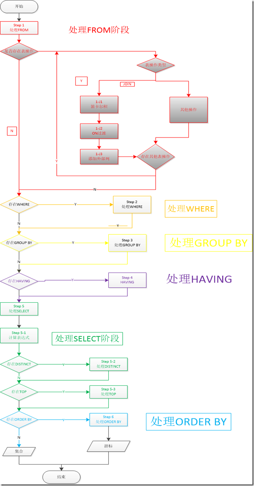

# SQL语句的解析过程

## SQL语句的解析顺序
简单的说一个sql语句是按照如下的顺序解析的：
1. FROM FROM后面的表标识了这条语句要查询的数据源。和一些子句如，（1-J1）笛卡尔积，（1-J2）ON过滤，（1-J3）添加外部列，所要应用的对象。FROM过程之后会生成一个虚拟表VT1。
(1-J1)笛卡尔积 这个步骤会计算两个相关联表的笛卡尔积(CROSS JOIN) ，生成虚拟表VT1-J1。
(1-J2)ON过滤 这个步骤基于虚拟表VT1-J1这一个虚拟表进行过滤，过滤出所有满足ON 谓词条件的列，生成虚拟表VT1-J2。
(1-J3)添加外部行  如果使用了外连接，保留表中的不符合ON条件的列也会被加入到VT1-J2中，作为外部行，生成虚拟表VT1-J3。    
2. WHERE 对VT1过程中生成的临时表进行过滤，满足where子句的列被插入到VT2表中。
3. GROUP BY 这个子句会把VT2中生成的表按照GROUP BY中的列进行分组。生成VT3表。
4. HAVING 这个子句对VT3表中的不同的组进行过滤，满足HAVING条件的子句被加入到VT4表中。
5. SELECT 这个子句对SELECT子句中的元素进行处理，生成VT5表。
(5-1)计算表达式 计算SELECT 子句中的表达式，生成VT5-1
(5-2)DISTINCT 寻找VT5-1中的重复列，并删掉，生成VT5-2
(5-3)TOP 从ORDER BY子句定义的结果中，筛选出符合条件的列。生成VT5-3表
6. ORDER BY 从VT5-3中的表中，根据ORDER BY 子句的条件对结果进行排序，生成VC6表。

### FROM子句
FROM子句标识了需要查询的表，如果指定了表操作，会从左到右的处理，每一个基于一个或者两个表的表操作都会返回一个输出表。左边表的输出结果会作为下一个表操作的输入结果。
- Step 1-J1：执行笛卡尔积(CROSS JOIN)

笛卡尔积会把左右两个表每一行所有可能的组合都列出来生成表VT1-J1，如果左表有m列，右表有n列，那么笛卡尔积之后生成的VT1-J1表将会有m×n列。
- Step 1-J2：应用ON过滤，(JOIN 条件)

ON过滤条件是sql的三个过滤条件(ON,WHERE,HAVING)中最先执行的，ON过滤条件应用于前一步生成的虚拟表(VT1-J1)，满足ON过滤条件的行会被加入到虚拟表VT1-J2中。

- Step 1-J3：添加外部列

这个步骤只会出现在使用了外连接的情况。对于外连接(LEFT,RIGHT, or FULL)，你可以标记一个或者两个表作为保留表。作为保留表意味着你希望这个表里面的所有列都被返回，即使它里面的数据不满足ON子句的过滤条件。LEFT OUTER JOIN 把左边的表标记为保留表，RIGHTOUTER JOIN把右边的表作为保留表，FULL OUTER JOIN把两个表都标记为保留表.Step 1-J3为根据VT1-J2中的虚拟表，添加了保留表中不满足ON 条件的列，在未保留表中没有对应的列，因此标记为NULL。这个过程生成了虚拟表VT1-J3。

### WHERE 子句
WHERE过滤被应用到前一步生成的临时表中，根据WHERE过滤条件生成临时表VT2。
注意：**由于数据现在还没有被分组，因此现在你不能使用聚合运算**-例如：你不能使用这样的句子 WHERE orderdate = MAX(orderdate)。另外你也不能使用SELECT子句中创建的变量别名，因为现在还没有处理SELECT子句-例如你不能写这样的句子：SELECT YEAR(orderdate) AS orderyear . . . WHERE orderyear > 2008.

>关于ON 和 WHERE 的区别需要在这里说明一下，ON 和WHERE 的主要区别在于 ON 实在添加外部列之前进行过滤，WHERE 是在之后。ON过滤掉的列会在1-J3中添加回来。如果你不需要添加外部列，那么这两个过滤是相同的。

### GROUP BY子句
这个子句会把前一步中生成的临时表中的数据进行分组，每一行都会分到并且只分到一个组里，生成虚拟表VT3。VT3表中包含了VT2表中所有的数据，和分组标识符。

sql最终返回的结果中，每一个分组必须只能返回一行(除非被过滤掉)，因此当一个sql语句中使用了GROUP BY时，在GROUP BY后面处理的子句，如SELECT，HAVING子句等，只能使用出现在GROUP BY后面的列，对于没有出现GROUP BY后面的列必须使用聚合函数(如 MAX ,MIN,COUNT,AVG等)，保证每一个GROUP只返回一行。
### HAVING子句
HAVING子句用来过滤前一步生成的临时表，并且只作用于分组后的数据，满足HAVING条件的GROUP被添加到虚拟表VT4中。
>需要注意的一点是由于这个查询中添加了外部列，COUNT方法会忽略NULL的列，导致出现了你不想要的结果。

### SELECT 子句
尽管出现在sql语句的最前面，SELECT在第五步的时候才被处理，SELECT子句返回的表会最终返回给调用者。这个子句包含三个子阶段：(5-1)计算表达式，(5-2) 处理DISTINCT，(5-3)应用TOP过滤。
- Step 5-1 计算表达式

SELECT子句中的表达式可以返回或者操作前一步表中返回的基本列。如果这个sql语句是一个聚合查询，在Step 3之后，你只能使用GROUP BY中的列，对不属于GROUP集合中的列必须使用聚合运算。不属于FROM表中基本列的必须为其起一个别名，如YEAR(orderdate) AS orderyear。

注意：在SELECT子句中创建的别名，不能在之前的Step中使用，即使在SELECT子句中也不能。原因是sql的很多操作是同时操作(all at once operation)，至于什么是all-at-once operation这里就不再介绍了。因此，SELECT子句中创建的别名只能在后面的子句中使用，如ORDER BY。例如：SELECT YEAR(orderdate) AS orderyear . . . ORDER BY orderyear。

- Step 5-2:应用DISTINCT子句

如果sql语句中使用了DISTINCT，sql会把重复列去掉，生成虚拟表VT5-2。

- Step 5-3:应用TOP选项

TOP选项是T-SQL提供的一个功能，用来表示显示多少行。基于ORDER BY子句定义的顺序，指定个数的列会被查询出来。这个过程生成虚拟表VT5-3。

- Step 6：ORDER BY子句

前一步返回的虚拟表在这一步被排序，根据ORDER BY子句指定的顺序，返回游标VC6。ORDER BY子句也是唯一一个可以使用SELECT子句创建的别名的地方。

注意:这一步和之前不同的地方在于，这一步返回的结果是一个游标，而不是表。sql是基于集合理论的，一个集合没有对他的行定义顺序，它只是一个成员的逻辑集合，因此成员的顺序并不重要。带有ORDER BY子句的sql返回一个按照特定序列组织每一行的对象。ANSI 把这样的一个对象叫游标。理解这一点对你了解sql很重要。

摘录自: [SQL语句的解析过程](http://www.cnblogs.com/myprogram/archive/2013/01/24/2874666.html#rd?sukey=7f8f3cb2e9b0da45490f78a3795d6fa592f1483017f0c49f2501e1f9700a9b6632d1742dd85f21f052592ef16e6c82b7) 